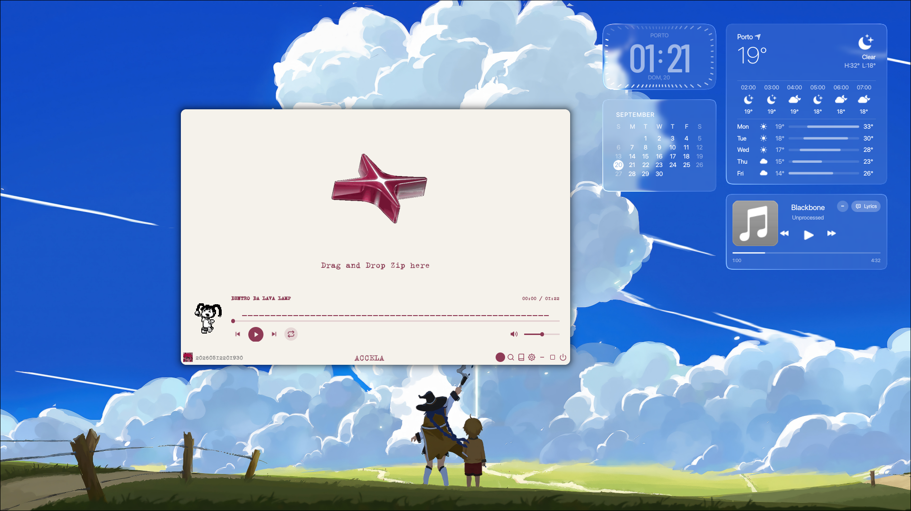

  

<h3 align="center">Building robust software, low-latency Linux interfaces, and exploring cybersecurity.</h3>

  
  
  

---

### 👨‍💻 About Me

- 🛡️ **Cybersecurity Intern & IT Technician** at [Sunviauto](https://sunviauto.pt/) (until Dec 2025)
- 🎓 Studying **Computer Engineering** at ISLA Gaia (2024 - 2027)
- 📜 Graduated with a CTeSP in **Computer Networks and Systems**
- 💻 Specialized in Linux system optimization (CachyOS / Arch Linux), Wayland compositors (Hyprland), custom QML/QuickShell desktop widgets, and reverse engineering.

---

### 🚀 Featured Projects

#### ❄️ [ashestia-dots](https://github.com/gabesvr/ashestia-dots)
> Zero-latency, minimalist gaming and daily productivity Hyprland setup on CachyOS / Arch Linux. Features custom QuickShell desktop widgets (clock, calendar, weather, music player with synchronized lyrics & LiquidGlass styling), foot terminal with Sixel Fastfetch rotation, and dynamic Matugen theming.

  

 

#### 🎨 [accela-custom-theme](https://github.com/gabesvr/accela-custom-theme)
> Custom aesthetic retro theme, integrated music player with dancing pixel art mascot, and 100% automated SLSsteam installer for ACCELA on Linux. Downloads directly to Steam library with instant restart optimizations and Hyprland floating window rules.

  

 

#### 🌊 [ondas-cava](https://github.com/gabesvr/ondas-cava)
> Custom real-time audio visualizer configurations and dynamic responsive waveforms for Linux terminals using CAVA.

#### ⚡ [Zeal](https://github.com/gabesvr/Zeal)
> Minimalist workout and fitness tracking application designed with a focused, distraction-free interface.

---

### 🛠️ Tech Stack & Tools

  <!-- Core Languages & Linux -->
  

  <!-- Security Tools (Custom Badges) -->
  
  
  
  

---

  
  

---

  <i>"Passionate about reverse engineering, low-level programming, and clean interfaces."</i>

