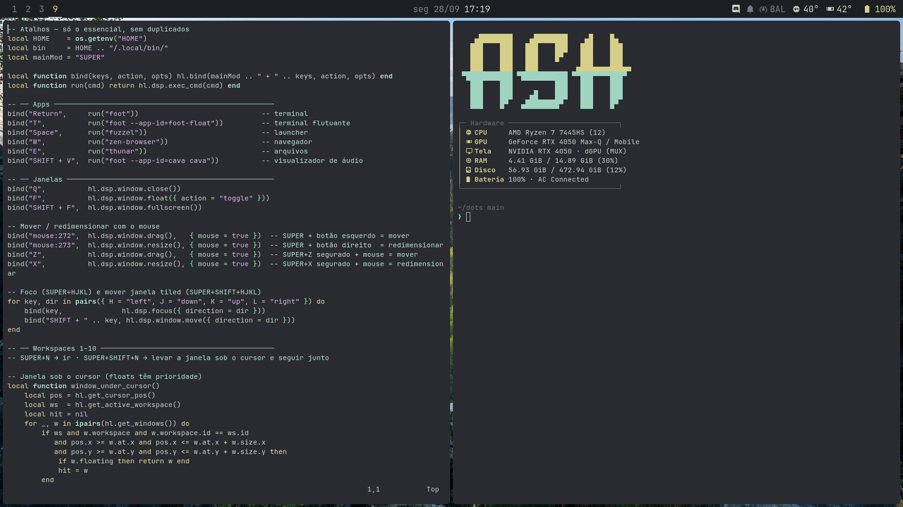
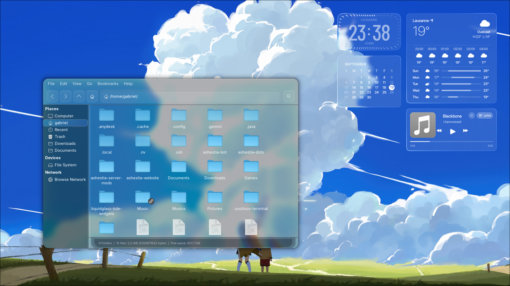
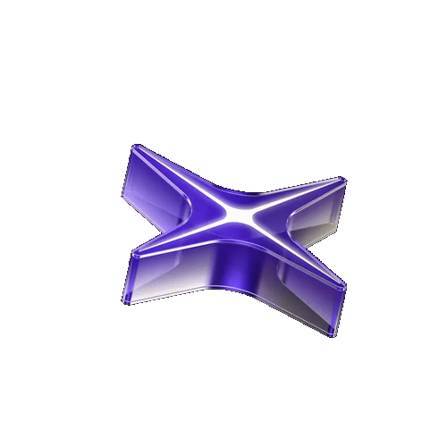

<div align="center">
  

  <a href="https://github.com/gabesvr">
    
  </a>

  <p>
    <a href="mailto:gabriellherique@gmail.com"></a>
    <a href="https://github.com/gabesvr"></a>
    <a href="https://www.instagram.com/gabesvr/"></a>
    
  </p>
</div>

<br>

## About me

```yaml
name:      Gabriel Henrique Vieira
based_in:  Porto, Portugal
studying:  Computer Engineering @ ISLA Gaia (2024 - 2027)
degree:    CTeSP in Computer Networks and Systems
worked_as: Cybersecurity Intern & IT Technician @ Sunviauto (until Dec 2025)
into:      [Linux optimization, Wayland / Hyprland, QML / QuickShell, reverse engineering]
daily:     CachyOS + Hyprland (my own rice, ash-dots)
```

<br>

## Featured projects

<table>
  <tr>
    <td colspan="2">
      <a href="https://github.com/gabesvr/ash-dots"></a>
      <h3><a href="https://github.com/gabesvr/ash-dots">ash-dots</a></h3>
      A Hyprland setup built for speed. No blur, shadows, animations or display manager: Lua config,
      yambar, fuzzel control center, C tools for the tray and GPU overclock, and a one-click <b>TURBO</b>
      mode (fans, GPU P0, CPU boost) for gaming on CachyOS.
      <br><br>
      
      
      
      
    </td>
  </tr>
  <tr>
    <td width="50%" valign="top">
      <a href="https://github.com/gabesvr/ashestia-dots"></a>
      <h3><a href="https://github.com/gabesvr/ashestia-dots">ashestia-dots</a></h3>
      The eye-candy sibling: QuickShell desktop widgets (clock, calendar, weather, music player with
      synced lyrics) in LiquidGlass style, Sixel fastfetch and Matugen theming.
      <br><br>
      
      
    </td>
    <td width="50%" valign="top">
      <a href="https://github.com/gabesvr/usolinux"></a>
      <h3><a href="https://github.com/gabesvr/usolinux">usolinux</a></h3>
      Game manager for Linux based on ACCELA: one-command install, automatic SLSsteam setup,
      a dreamy Y2K theme and a pixel-art music player.
      <br><br>
      
      
    </td>
  </tr>
</table>

<br>

## Tech stack

<p align="center">
  
</p>

<p align="center">
  
  
  
  
</p>

<br>

## Activity

<div align="center">
  
</div>

<br>

<div align="center">
  
  <sub><i>Passionate about reverse engineering, low-level programming and clean, fast interfaces.</i></sub>
</div>
